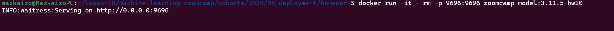
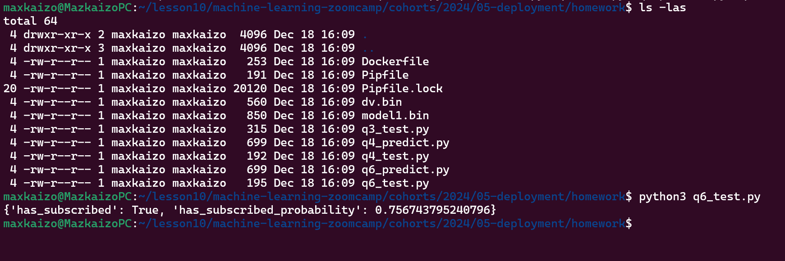
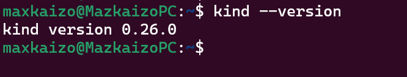
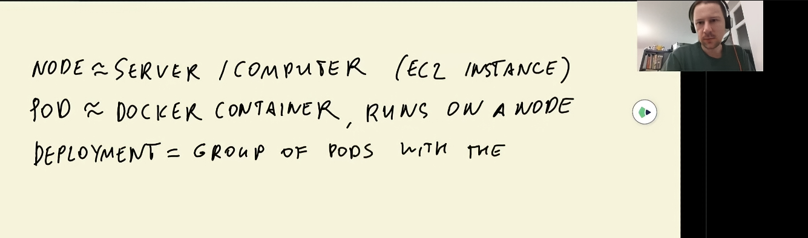
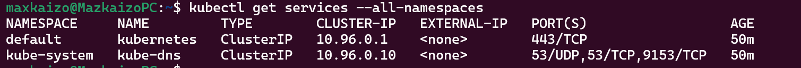
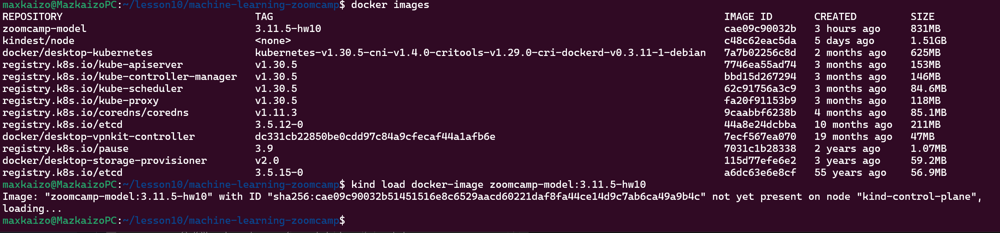
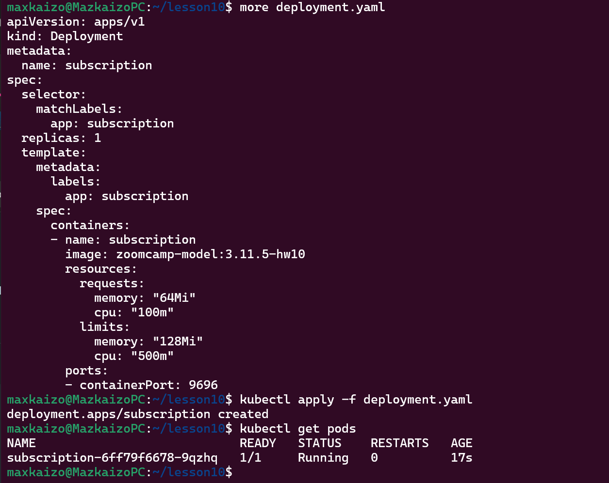
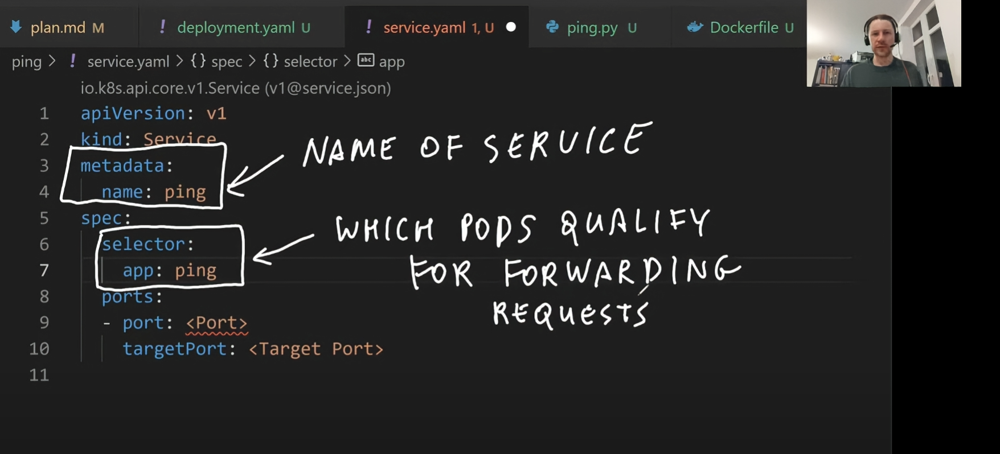
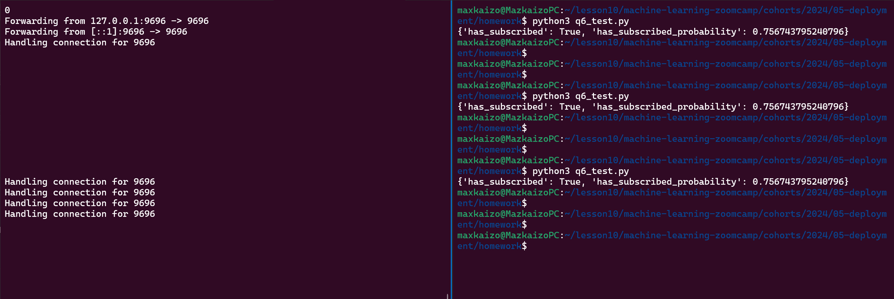
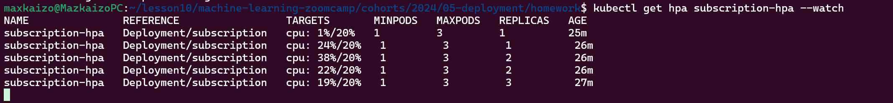

# MD file for homework 10

## Question 1. 

<value> of the probability of getting a subscription (1 point)

0.287
0.530
0.757
0.960

### Answer = 0.757

Screenshots

## Question 2 

What's the version of kind that you have?

Use kind --version to find out.

### Answer = kind version 0.26.0

## Question 3
What's the smallest deployable computing unit that we can create and manage in Kubernetes (kind in our case)?

Node
Pod
Deployment
Service

### Answer = pod

## Question 4
Now let's test if everything works. Use kubectl to get the list of running services.

What's the Type of the service that is already running there?

NodePort
ClusterIP
ExternalName
LoadBalancer

### Answer = ClusterIP

## Question 5

To be able to use the docker image we previously created (zoomcamp-model:3.11.5-hw10), we need to register it with kind.

What's the command we need to run for that?

kind create cluster
kind build node-image
kind load docker-image
kubectl apply

### Answer = kind load docker-image

## Question 6 

What is the value for <Port>?

### Answer = 9696

## Question 7

Fill it in. What do we need to write instead of <???>?

### Answer = 9696

## Testing the service

kubectl port-forward service/subscription 9696:80

## Question 8 (optional)

Run kubectl get hpa subscription-hpa --watch command to monitor how the autoscaler performs. Within a minute or so, you should see the higher CPU load; and then - more replicas. What was the maximum amount of the replicas during this test?

